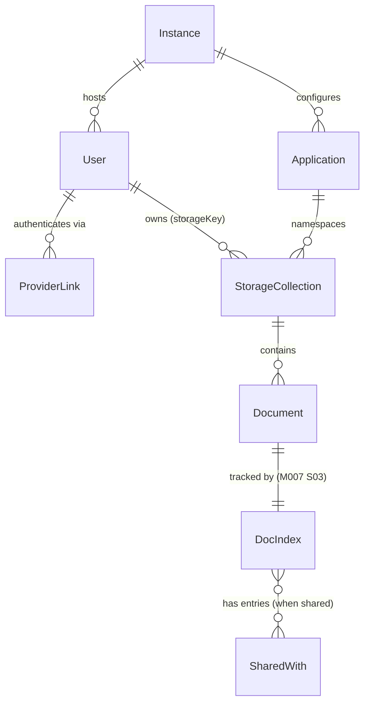
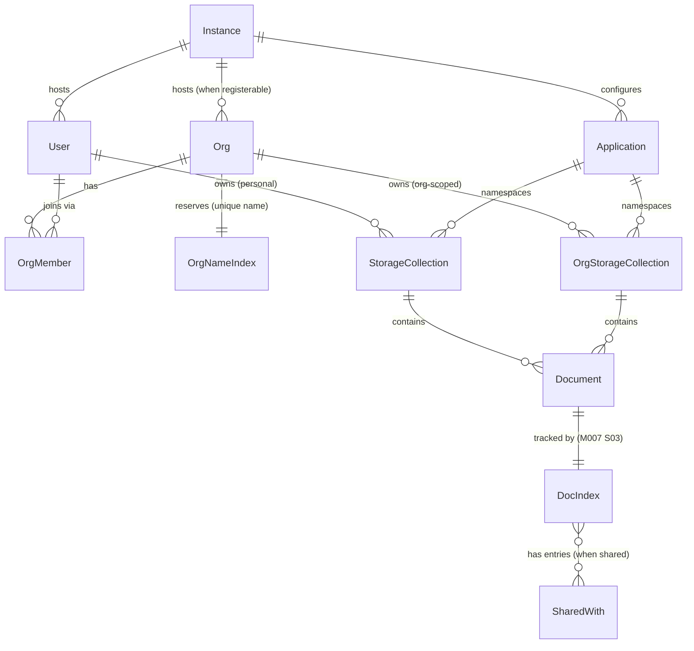

# Data Model Reference

This document is the canonical entity model reference for **data-api**. It covers both operating modes (flat/no-org and org-enabled), Mermaid ER diagrams for each mode, all entity field shapes sourced from the implementation, every storage key pattern with encoding rules, and the sharing model design.

---

## Table of Contents

1. [Overview](#1-overview)
2. [Operating Modes](#2-operating-modes)
3. [ER Diagram — Flat / No-Org Mode](#3-er-diagram--flat--no-org-mode)
4. [ER Diagram — Org-Enabled Mode](#4-er-diagram--org-enabled-mode)
5. [Entity Shapes](#5-entity-shapes)
6. [Storage Key Reference](#6-storage-key-reference)
7. [Sharing Model](#7-sharing-model)
8. [Data Export](#8-data-export)
9. [Account & Org Deletion](#9-account--org-deletion)

---

## 1. Overview

data-api is an offline-first, bidirectional sync API. Clients maintain local data copies and sync with the server using field-level merge and HLC-based causal conflict resolution.

**Which mode to use:**

| Scenario | Mode |
|---|---|
| Single-tenant app, no team features | Flat / No-Org |
| Multi-tenant, team workspaces, or org-scoped documents | Org-Enabled |

Both modes share the same sync API. Org-enabled mode adds `Org`, `OrgMember`, and `OrgNameIndex` entities and an org-scoped document storage namespace (`org:{orgId}:{app}:{collection}`).

---

## 2. Operating Modes

### Flat / No-Org Mode

Config shape — only the `applications` block is required:

```js
{
  applications: {
    'year-planner': {
      collections: {
        planners: { schemaPath: './schemas/planner.json' }
      }
    },
    todo: {
      collections: {
        tasks: {}
      }
    }
  }
}
```

All documents belong to the authenticated user. Storage keys are namespaced as `{userId}:{app}:{collection}`.

### Org-Enabled Mode

Config shape — add an `orgs` block alongside `applications`:

```js
{
  applications: {
    'year-planner': {
      collections: {
        planners: { schemaPath: './schemas/planner.json' }
      }
    }
  },
  orgs: {
    registerable: true
  }
}
```

The `orgs.registerable` flag controls whether `POST /orgs` (self-service org creation) is open. It defaults to `false`.

| `orgs.registerable` | `POST /orgs` behaviour |
|---|---|
| `true` | Any authenticated user may create an org |
| `false` (default) | Returns `403 Forbidden` — "Organisation registration is disabled on this instance." |

When org-enabled, org-scoped documents are stored under the key `org:{orgId}:{app}:{collection}` and accessed by including the `X-Org-Id` request header.

---

## 3. ER Diagram — Flat / No-Org Mode



**Notes:**
- **Application** is config-only — it is not a stored database entity. It exists only as an entry in the `applications` config block and is enforced by `ApplicationRegistry`.
- **StorageCollection** represents the namespaced jsnosqlc collection. It is not a stored record itself; it is a logical namespace with key `{userId}:{app}:{collection}`. Each collection is created on first write.
- **DocIndex** and **SharedWith** are introduced in M007/S03 (write-side) and enforced in M008 (read-side ACL filtering).

---

## 4. ER Diagram — Org-Enabled Mode

Extends flat mode by adding `Org`, `OrgMember`, `OrgNameIndex`, and an org-scoped storage namespace.



**Notes:**
- **OrgStorageCollection** is a logical org-scoped namespace with key `org:{orgId}:{app}:{collection}`. Accessed by providing `X-Org-Id` header on sync requests.
- **OrgNameIndex** is a uniqueness index (collection `orgNames`, key `{name}`) that prevents duplicate org names. Designed in M007/S04.
- All other notes from flat mode apply here.

---

## 5. Entity Shapes

Field shapes sourced directly from the implementation. All timestamps are ISO 8601 strings.

### User

Collection: `users` | Key: `{userId}`  
Source: `packages/auth-server/UserRepository.js`

```json
{
  "userId": "uuid",
  "email": "string | null",
  "providers": [
    { "provider": "string", "providerUserId": "string" }
  ],
  "createdAt": "ISO8601",
  "updatedAt": "ISO8601"
}
```

### ProviderLink

Collection: `providerIndex` | Key: `{provider}:{providerUserId}`  
Source: `packages/auth-server/UserRepository.js`

A lookup index: given a provider + providerUserId, resolves to a `userId` without scanning all users.

```json
{
  "userId": "uuid",
  "provider": "string",
  "providerUserId": "string"
}
```

### Org

Collection: `orgs` | Key: `{orgId}`  
Source: `packages/auth-server/OrgRepository.js`

```json
{
  "orgId": "uuid",
  "name": "string",
  "createdBy": "userId",
  "createdAt": "ISO8601"
}
```

### OrgMember

Collection: `orgMembers` | Key: `{orgId}:{userId}`  
Source: `packages/auth-server/OrgRepository.js`

```json
{
  "orgId": "uuid",
  "userId": "uuid",
  "role": "org-admin | member",
  "joinedAt": "ISO8601"
}
```

### OrgNameIndex

Collection: `orgNames` | Key: `{name}`  
Designed: M007/S04 (not yet implemented)

A uniqueness index that maps an org name to its `orgId`, preventing duplicate org names.

```json
{
  "orgId": "uuid"
}
```

### Document

Stored in a namespaced jsnosqlc collection; key is application-defined (`docKey`).  
Source: `packages/server/SyncRepository.js`

Application fields are stored alongside sync metadata fields (`_key`, `_rev`, `_fieldRevs`):

```json
{
  "...appFields": "...",
  "_key": "string",
  "_rev": "hlcString",
  "_fieldRevs": { "dotPath": "hlcString" }
}
```

- `_rev` is an HLC hex string, lexicographically ordered — used by `changesSince()` queries with `Filter.gt()`.
- `_fieldRevs` maps dot-path field names to their last-write HLC for per-field conflict resolution.

### DocIndex

Collection: `docIndex` | Key: `docIndex:{userId}:{app}:{docKey}`  
Designed: M007/S03 (write-side); M008 enforces read-side ACL filtering.

```json
{
  "docKey": "string",
  "userId": "uuid",
  "app": "string",
  "collection": "string",
  "visibility": "private | shared | org | public",
  "sharedWith": [
    { "userId": "uuid", "app": "string" }
  ],
  "shareToken": "uuid | null",
  "createdAt": "ISO8601",
  "updatedAt": "ISO8601"
}
```

### Application

Config-only — **not stored in the database**.  
Source: `packages/server/ApplicationRegistry.js`

```json
{
  "[appName]": {
    "description": "string (optional)",
    "collections": {
      "[colName]": {
        "schema": "(JSON Schema object, optional)",
        "schemaPath": "string (optional)"
      }
    }
  }
}
```

Unknown application names result in a `404` response. The `ApplicationRegistry` enforces the allowlist at request time.

---

## 6. Storage Key Reference

All storage is mediated by jsnosqlc. Collections are created on first write.

### Encoding Rule

The colon `:` is the segment separator in collection names and composite keys. Any `:` appearing **within a segment value** is percent-encoded as `%3A` to keep the separator unambiguous. The separator `:` between segments is never encoded.

**Source:** `packages/server/namespaceKey.js`

```js
const encode = (s) => String(s).replace(/:/g, '%3A');
return `${encode(userId)}:${encode(application)}:${encode(collection)}`;
```

### Key Table

| Context | jsnosqlc collection | Key pattern | Source |
|---|---|---|---|
| Personal document storage | `{userId}:{app}:{collection}` | `{docKey}` within collection | `packages/server/namespaceKey.js` |
| Org-scoped document storage | `org:{orgId}:{app}:{collection}` | `{docKey}` within collection | `packages/hono/AppSyncController.js` |
| User record | `users` | `{userId}` | `packages/auth-server/UserRepository.js` |
| Provider identity link | `providerIndex` | `{provider}:{providerUserId}` | `packages/auth-server/UserRepository.js` |
| Org record | `orgs` | `{orgId}` | `packages/auth-server/OrgRepository.js` |
| Org membership | `orgMembers` | `{orgId}:{userId}` | `packages/auth-server/OrgRepository.js` |
| Org name uniqueness index | `orgNames` | `{name}` | Designed: M007/S04 |
| Document ownership index | `docIndex` | `docIndex:{userId}:{app}:{docKey}` | Designed: M007/S03 |

**Notes:**
- `org:` prefix on collection names is unambiguous because `userId` values are UUIDs and never begin with `org:`.
- The `docIndex` key prefix `docIndex:` is included in the key value itself (not the collection name) to allow multiple document indexes to coexist in the same collection in future.

---

## 7. Sharing Model

The sharing model controls which users can read a document via `changesSince` and `POST /:application/search`. The `visibility` field on `DocIndex` determines access.

> **Implementation status:** DocIndex upsert, visibility, sharedWith, and shareToken minting were implemented in M007/S03 (write side). Read-side ACL enforcement is fully implemented in M008: `changesSince` aggregates cross-namespace shared/public docs via a server-side docIndex fan-out, and `POST /:application/search` enforces the same ACL gate.

### Visibility Levels

| Value | Who can read via `changesSince` | Appears in search results | Notes |
|---|---|---|---|
| `private` | Owner only | Owner only | Default. `sharedWith` entries are not consulted. |
| `shared` | Owner + every `{userId, app}` pair in `sharedWith` | Owner + sharedWith users | Per-app scoped. Sharing a `year-planner` doc does **not** grant access to the user's `todo` items. |
| `org` | All members of the document owner's org, for the same app | Org members | Requires `X-Org-Id` header. Org membership is checked via `OrgRepository`. |
| `public` | Any authenticated user | Any authenticated user | Explicit opt-in to discoverability. |

> **`public` vs share token:** `visibility: 'public'` is an explicit opt-in that makes a document discoverable in open search results for any authenticated user. A share token alone (`visibility` is not `'public'`) grants direct-link access only — such documents **do not** appear in search results. The two mechanisms have different intent and are enforced separately. See D013.

### `sharedWith` Shape

Each entry in `sharedWith` is a `{userId, app}` pair, scoping the share to a specific application namespace:

```json
[
  { "userId": "uuid", "app": "year-planner" },
  { "userId": "uuid", "app": "todo" }
]
```

Sharing is additive — adding a user to `sharedWith` for `year-planner` does not affect access to any other app's documents.

### Share Token

`shareToken` is a UUID stored on `DocIndex`. It is minted by the server on request and stored as `docIndex.shareToken`. A `null` value means share-token access is not enabled for that document.

**Upgrade path:** A future improvement is a deterministic JWT (`sign({ docKey, app, userId }, instanceSecret)`) that requires no storage, is stable for the document lifetime, and can be verified without a database lookup.

### Summary Flow

```
Authorization: Bearer <jwt>   ← required for all ACL-gated endpoints (private / shared / org / public)
X-Org-Id: <orgId>             ← required for org visibility
```

---

## 8. Data Export

Full data export is available via two endpoints. Exports are synchronous single-request downloads. Documents are grouped by application name, then collection name, mirroring the storage namespace structure.

### User Export — `GET /account/export`

Requires JWT authentication. Returns all data for the authenticated user.

**Envelope shape:**
```json
{
  "user": { "userId": "uuid", "email": "...", "providers": [...] },
  "docs": {
    "year-planner": {
      "planners": [{ "_key": "planner-2026", ... }]
    },
    "todo": {
      "tasks": [{ "_key": "task-1", ... }]
    }
  },
  "docIndex": [
    {
      "docKey": "planner-2026",
      "userId": "uuid",
      "app": "year-planner",
      "collection": "planners",
      "visibility": "shared",
      ...
    }
  ]
}
```

**Collection discovery:** Personal export derives the collection list from `docIndex.listByUser()` — only collections the user has actually written to are included. Empty apps and collections are pruned from the envelope.

Returns `404` if the user record does not exist (e.g. after deletion).

### Org Export — `GET /orgs/:orgId/export`

Requires JWT authentication + **org-admin** role. Returns all data for the organisation.

**Envelope shape:**
```json
{
  "org": { "orgId": "uuid", "name": "Acme Corp", "createdBy": "uuid", "createdAt": "ISO8601" },
  "members": [
    { "orgId": "uuid", "userId": "uuid", "role": "org-admin", "joinedAt": "ISO8601" }
  ],
  "docs": {
    "year-planner": {
      "planners": [{ "_key": "org-planner-2026", ... }]
    }
  }
}
```

**Collection discovery:** Org export enumerates collections from `ApplicationRegistry` config — all configured collections are checked, even if empty. Empty apps and collections are pruned from the envelope.

Returns `403` if caller is not org-admin. Returns `404` if the org record does not exist.

---

## 9. Account & Org Deletion

Hard delete is supported for both user accounts and organisations. All deletion is synchronous and **irreversible** — there is no tombstone, TTL, or async sweep. See D011.

### User Deletion — `DELETE /account`

Requires JWT authentication. Cascades through all personal data:

1. For each configured app: fetch docIndex entries via `listByUser`, group by collection, delete all personal documents, delete all docIndex entries
2. Remove all org membership records (from every org the user belongs to)
3. Remove all OAuth provider index entries (`{provider}:{providerUserId}` keys)
4. Delete the user identity record

Returns `204` (no body) on success.

### Org Deletion — `DELETE /orgs/:orgId`

Requires JWT authentication + **org-admin** role. Cascades through all org data:

1. For each configured app: enumerate collections from ApplicationRegistry, delete all org-scoped documents (`org:{orgId}:{app}:{collection}` namespace)
2. Remove all org membership records
3. Release the org name uniqueness reservation
4. Delete the org identity record

Returns `204` (no body) on success. Returns `403` if caller is not org-admin. Returns `404` if the org does not exist.

### Recommended workflow before deletion

```
# User deletion
GET  /account/export         → save archive
DELETE /account              → 204
GET  /account/export         → 404 (confirmed gone)

# Org deletion
GET  /orgs/:orgId/export     → save archive
DELETE /orgs/:orgId          → 204
GET  /orgs/:orgId/export     → 404 (confirmed gone)
```
